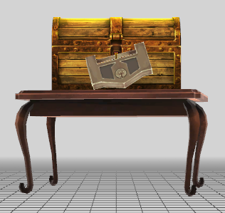

# Placing Treasure Chests

<figure><figcaption><p>Viewable in 010 Editor using my fork of the .FBN Binary Template</p></figcaption></figure>

This is an **FBN** with 2 Treasure Chests in it ( internally known as **TBox** ). The structure is rather small and that is because, perplexingly, ATLUS chose not to include data such as what the Chest _contains_ or what script procedure to run in the **FBN** itself, instead choosing to spread this data around into several other tables. \
If you wish to simply move existing Chests around or change their assigned model, you only need to edit the **FBN**. However, adding new Chests or adding/editing Chest contents requires significantly more editing which will be covered under **Editing Field Resident Tables > Creating Treasure Chests**. \
\
When opening an **FBN**, you will likely see many Blocks. In the **Value** column of the 010 Template Output will be the Block Type and therefore you need to open Block 9. Remember that placing a Chest block in an Overworld field will crash the game!\
\
Each Entry looks like this:

```clike
s32 Field00;
Vector3 Position;
Quaternion Rotation;
s16 Model_MajorID;
s16 Model_MinorID;
u16 Chest_ResourceHandle;
s16 Field26;
```

It's currently unknown what **Field00** does. Ingame, walk to a location you deem for a Treasure Chest and open the Mod Menu or simply place a node in 3DSMax. These are the **XYZ** values to be filled into the **Position** Vector. The same applies to the **Rotation** Vector as long as the rotations are in **Quaternion Rotation**.&#x20;


Quaternion Rotation is different from Euler Degrees. If you don't know how to convert Euler Degrees into Quaternion Rotation, [THIS ](../../basics/rotation-conversions.md#euler-degrees-to-quaternion)is how.


The **Model\_MajorID** and **MinorID** refer to the model used by that specific Chest, which is loaded from **model/field\_tex/object** based on the values in the struct.&#x20;

<figure><figcaption><p>model/field_<em>tex/object/m300</em>_001.GMD</p></figcaption></figure>

This is an example Chest model from the object folder. It is ID **300\_001** and is believed to be unused, as it is replaced by a Will Seed in Persona 5 Royal.&#x20;


Will Seeds in Persona 5 Royal are actually just Treasure Chests with a different Model ID and unique script function! If you know how to move Chests, you can move Seeds as well.


**Chest Resource Handle** is a value only used in field box scripts, It is a unique "Tag" assigned to most object models and entities that allows the game to easily search for the model to run commands on it. Internally you will find it being called Resource Handle and RESHND interchangeably. For Treasure Chests in Palace fields, a standard RESHND is 64000+. &#x20;


Remember to place any custom model IDs in the _right folder_ before assembling your CPK. The Persona 5 codebase **softlocks** when a file loading cannot be found normally. If your field is not loading after changing the Model ID, check **RPCS3's TTY Log** to see what model is stuck.&#x20;

