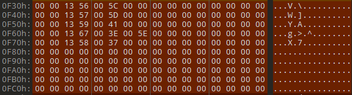

# Fixing Footstep Sounds

<figure><figcaption><p>Viewable with the fldFootStepCnd Binary Template</p></figcaption></figure>

In one of the stranger and more illogical moves made by ATLUS during development, fields do **not** automatically make sounds when characters are walking. Instead, there is an .**FTD file** that dictates the fields where this can occur.\
\
Each Entry looks like this:

```
uint16 Field_Major_ID;
uint16 Field_Minor_ID;
u16 Sound;
```

The **Field Major ID** and **Minor ID** tell the game what field to target with the subsequent values. The **Sound** value is an enum with one of several different sounds that can be all found in **sound/system.acb in** groups.

| ID # |            | System ACB Party Cue ID | System ACB Joker Cue ID |
| ---- | ---------- | ----------------------- | ----------------------- |
| 1    | Wood       | 285                     | 305                     |
| 2    | Stone      | 281                     | 301                     |
| 3    | Grass      | 283                     | 303                     |
| 4    | Soil       | 282                     | 302                     |
| 5    | Carpet     | 286                     | 306                     |
| 6    | Metal      | 284                     | 304                     |
| 7    | Bare       | 270                     | 290                     |
| 8    | Crawl      | 271                     | 291                     |
| 9    | Sand       | 272                     | 292                     |
| 10   | Wet        | 273                     | 293                     |
| 11   | Creak      | 274                     | 294                     |
| 12   | Wood Creak | 285 + 274               | 305 + 294               |
| 13   | Silence    | -1                      | -1                      |
| 14   | Thin Metal | 287                     | 307                     |

To add a new condition to this table, Copy and Paste an Entry and change the **Number of Sub-Entries** on top. Make sure to add the Entry size to the **Sub Entry Section Size** value _( 8 bytes )._&#x20;
